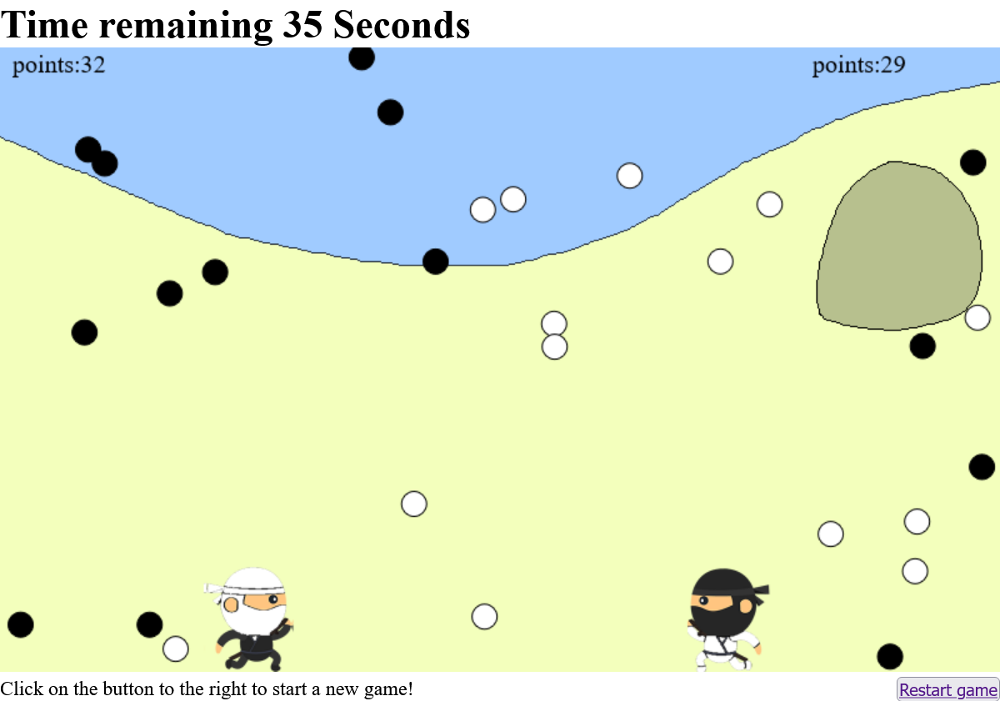

# Ninja School Wars

This is a 2D game where two players, represented by ninjas, compete to collect energy orbs. The game is built using JavaScript and the HTML5 Canvas for rendering.

## Game Mechanics

- The game features two types of energy orbs: white and black. These orbs appear randomly on the screen and move towards the left.
- Each player controls a ninja: one black and one white. The players can move their ninjas up, down, left, and right to collect the energy orbs.
- The black ninja collects black energy orbs, and the white ninja collects white energy orbs. Each collected orb increases the player's score by one.
- The game ends after a certain time period (currently set to 60 seconds). The player with the highest score at the end of the game is declared the winner.

## Controls

- Player 1 controls the black ninja using the W (up), A (left), S (down), and D (right) keys.
- Player 2 controls the white ninja using the arrow keys.

## Technical Details

- The game uses classes to define the players and the energy orbs. Each class has properties like position, speed, and radius, and methods for updating the object's state and drawing it on the canvas.
- The game loop is handled by the `animate` function, which clears the canvas, updates and draws the game objects, and then calls itself again using `requestAnimationFrame`.
- Collision detection between the ninjas and the energy orbs is done by calculating the distance between them and checking if it's less than the sum of their radii.
- The game uses the `keydown` and `keyup` events to handle player input. The keys that are currently pressed are stored in the `keys` array.
- The game uses the `setInterval` function to check for a winner every 60 seconds.