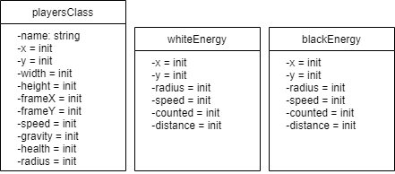

# PRG04 HERKANSING eindopdracht 

Wanneer je volledige eindcijfer (klassendiagram + afgeronde eindopdracht) een onvoldoende is kan je het hele project herkansen. 

- [Kies een nieuwe startopdracht met uniek thema en game mechanic in de gaminator](https://hr-cmgt.github.io/gaminator/) 
- Bedenk hiermee een nieuw game concept. 
- Maak een **nieuw klassendiagram**. 
- **Bouw je nieuwe game** in Object Oriented Typescript.
- Vul dit inleverdocument helemaal in

## Deadline: 23 augustus

**De deadline voor het inleveren van de game is Maandag 23 augustus om 10:00 (week 0).**

⚠️ Je werk wordt **beoordeeld volgens de cursushandleiding**. Lees dit nog even goed door voordat je je project inlevert.

---

<br>
<br>
<Br>

# Klassendiagram

Plaats je klassendiagram als PNG bestand. Dat kan je doen met een image tag:

```javascript

```
## Classes en verantwoordelijkheden

Toelichting classes en verantwoordelijkheden

Er zijn 3 classes: playersClass, whiteEnergy en blackEnergy. De playersClass wordt gebruikt voor de creatie van 2 players. De classes whiteEnergy en blackEnergy worden gebruikt voor de 'energy balls'.

## Encapsulation

Toelichting encapsulation

De classes zijn private. Ik kon eigenlijk geen nuttige toepassing bedenken voor een niet-private class in deze game, vandaar dat ik voor deze standaard optie heb gekozen. Ik heb wel gebruik gemaakt van een getter en setter voor de playerClass, zodat er op basis van de kleur van de speler een bericht verschijnt als één van beide spelers wint. Daarnaast hoef ik in de toekomst wat minder code hoeven te schrijven als ik bijvoorbeeld één of meerder ninjas toevoeg.

## Composition

Toelichting composition

Ik moet eerlijk zeggen dat ik zowel composition als inheritance niet goed genoeg begrijp om te weten of ik het heb gebruikt. Sorry.

## Inheritance

Ik moet eerlijk zeggen dat ik zowel composition als inheritance niet goed genoeg begrijp om te weten of ik het heb gebruikt. Sorry.

<br>
<br>
<Br>

# Game

Mijn nieuwe thema uit de [gaminator](https://hr-cmgt.github.io/gaminator/) is: Fellowship - Destroy - Ninjas

Toelichting gameplay: Het doel van het spel is om binnen 60 seconde zoveel mogelijk "energy balls" te vangen. Het spel moet gespeeld worden door twee mensen. Je bestuurt je ninja door gebruik te maken van "wasd" of de pijltoetsen. De zwarte ninja (die links spawnt) vangt de witte energy balls en de witte ninja (die rechts spawnt) vangt de witte energy balls.

## Classes

Toelichting classes

Er zijn 3 classes: playersClass, whiteEnergy en blackEnergy. De playersClass wordt gebruikt voor de creatie van 2 players. De classes whiteEnergy en blackEnergy worden gebruikt voor de 'energy balls'.

## Encapsulation

Toelichting encapsulation

Ik heb gebruik gemaakt van een getter en setter voor de playerClass, zodat er op basis van de kleur van de speler een bericht verschijnt als één van beide spelers wint. Daarnaast hoef ik in de toekomst wat minder code hoeven te schrijven als ik bijvoorbeeld één of meerder ninjas toevoeg.

## Composition

Toelichting composition

Ik moet eerlijk zeggen dat ik zowel composition als inheritance niet goed genoeg begrijp om te weten of ik het heb gebruikt. Sorry.

## Inheritance

Toelichting inheritance

Ik moet eerlijk zeggen dat ik zowel composition als inheritance niet goed genoeg begrijp om te weten of ik het heb gebruikt. Sorry.

## Game development technieken

Beschrijving game development technieken

HTML+ CSS Basics: De game heeft zowel basic HTML als CSS. Niet fancy, wel functioneel!
Game Loop: De game heeft een game loop. Op het moment dat de game afgelopen is (na 60 seconde) dan stopt het spel (animatie) en komt in beeld wie van beide spelers gewonnen heeft.
Collision detection: De collision detection voor deze game wordt gebruikt voor de spelers om de energy balls te vangen, waarna ze punten krijgen.
Besturing: De game wordt bestuurd met "wasd" en de pijltoetsen, afhankelijk van het feit of je als black ninja of white ninja speelt.
Timer: De timer is 60 seconde. Nadat de timer is afgelopen wordt gekeken wie van beide spelers de meeste punten heeft. Dit komt vervolgens in beeld te staan.
Object pool: De game bevat energy balls die spelers moeten vangen. De energy balls respawnen telkens wanneer ze een bepaalde hoeveelheid buiten het scherm zijn.

De ninja sprite is trouwens een reskin (de kleuren waren niet passend voor mijn game, dus ik heb het aangepast) van een sprite van spriters-resource.com afkomstig van een gebruiker genaamd silasjohn.